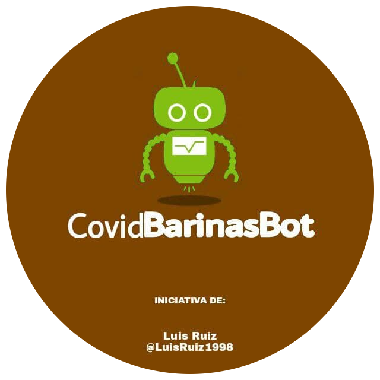

#CovidBarinasBot

**CovidBarinasBot** Es un bot para telegram hecho en Python para el 2020 con el objetivo de '**informar acerca del COVID-19**', fue realizado como proyecto tecnológico para graduarme en mi Bachillerato.

**¿Y como funciona?** Puedes comunicarte con el bot escribiendo su nombre en tu buscador de telegram e iniciando un chat con el Bot, luego de realizar una pregunta enviará alguna respuesta acorde a lo programado.

Si no tiene una respuesta te lo indicará y mostrará botones para que puedas elegir lo que quieres saber, entre ellos hay digamos varias secciones.

'**Nota:**' 1-El Bot no esta en funcionamiento ahora.
2-Para el funcionamiento del bot se utiliza la libreria "telbot" que esta en la API pyTelegramBotAPI. 

*[pyTelegramBotAPI](https://github.com/eternnoir/pyTelegramBotAPI) by [eternnoir](https://github.com/eternnoir)

